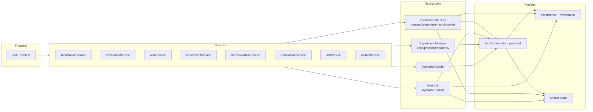

# Architecture Validation Report — eval-lab

**Date:** 2026-08-01 · **HEAD:** `df77d27` (GUI Milestone 1 on top of Phase 5 + dashboard)
**Scope:** read-only validation against the target architecture; no implementation performed.

---

## A. Current system map (what actually exists)

| Layer | What exists (files) | Notes |
|---|---|---|
| **Frontend / GUI** | `dashboard/web/src/` — Svelte 5 SPA: `App.svelte` (6-area nav), `Overview`, `Models`, `ModelDetail`, `RegisterModel`, `Evaluation` (M2 placeholder), `AtlasLab`/`Experiments`/`Comparisons` (placeholders), `Runs`, `RunDetail`, `Placeholder`, `lib/api.js` | Hash router, no router lib; talks to REST only |
| **API** | `src/eval_lab/dashboard/api.py` — FastAPI: run API (`/api/health|overview|models|runs…`) + M1 model-asset API (`/api/models-assets…`); serves built SPA | Run API reads `RunStore` directly; no formal service wrapper for runs |
| **Application services** | `services/models.py` `ModelAssetService` + pure `resolve_available_actions`; `inspection/checkpoint.py` (SafeTensors header-only) | Only model-asset service exists |
| **Schemas** | `schemas/models.py` (TaskSpec, SuiteSpec, ModelConfig, HarnessConfig, RunManifest, ScoreResult, TraceEvent); `schemas/model_asset.py` (M1) | Versioned Pydantic, `extra="forbid"` |
| **Runners** | `runners/direct.py`, `agent.py`, `agent_executor.py`, `batch.py`, `perf.py` | Synchronous, in-process; no GUI wiring yet |
| **Model adapters** | `adapters/mock.py`, `openai_compatible.py`, `scripted.py`, `timing.py`, `factory.py` | OpenAI-compatible + deterministic mocks |
| **Task registry** | `tasks/loader.py`, `config/labels.py`; 38 tasks across 12 domains | Tasks carry domain/capability/modality/trajectory/failure/intervention labels |
| **Suite registry** | `tasks/loader.py` (`load_suite_yaml`); `configs/suites/` (daily_driver, general_retention, stress, atlas, hardware_perf, smoke_direct) | Suites carry per-task weights (Phase 5) |
| **Scorers** | `scorers/` (deterministic, artifact, trajectory, unit_test, visual) + `aggregate.py` (weighted, required-gating, error≠zero) | oracle-first |
| **Telemetry** | `telemetry/` (system, nvidia, nvme, network, process collectors; sampler; correlation) | missing→`available:false`, not fabricated |
| **Traces** | `traces/recorder.py` | `resource_sample`, timing markers, monotonic seq |
| **Comparison engine (Phase 5)** | `analysis/` (statistics, significance, slices, weighted, comparison, regression, pareto, rows, weighting) + `reports/analysis.py` | Pure analysis; no ComparisonService wrapper |
| **Judges** | `judges/` (protocol, adapter, calibration, pairwise) | calibrated; judge gated on threshold |
| **Persistence** | `storage/sqlite.py` `RunStore` (runs+scores index); `storage/model_assets.py` JSON registry; `storage/artifacts.py` `RunWorkspace` (manifest/result/scores/trace/report as files) | Metadata in SQLite; traces/artifacts on disk |
| **Jobs** | **none** | No orchestrator, no persisted job state machine, no workers |
| **Atlas** | **none** (only `configs/suites/atlas.yaml` is a *suite*, not a runtime; Phase 8 trace fields reserved in spec only) | `source_atlas_run_id` ref field exists on assets |
| **Experiments / keep/precision/residency maps / derivative / repair / distillation** | **none** | asset holds `source_experiment_id` ref only |
| **CLI** | `cli/main.py` — doctor/validate/list/run/perf/score/report/list-runs/calibrate-judge/evaluate/compare/pareto | Phase 5 analysis reachable via CLI, not GUI |

---

## B. Target-to-current mapping

Classification per spec component:

| Target component | Status |
|---|---|
| Application / GUI (common shell) | **implemented (partial)** — 6 of 8 areas; Jobs + Settings areas missing; Evaluation/Atlas/Experiments/Comparisons are placeholders |
| Model Asset Registry | **implemented (partial)** — registry + inspection + eligibility good; a few asset types (teacher, multimodal aux, draft) not modelled distinctly |
| Evaluation Harness (task/suite registry, direct/agent runner, scorers, telemetry, comparison engine) | **implemented** — core harness complete with 138 tests |
| Comparison engine | **implemented** (Phase 5, CLI-only; no GUI / no `ComparisonService`) |
| Atlas Lab (layerwise runtime, trace, analysis, exploration) | **missing** |
| Experiment Manager (keep/precision/residency maps, repair, distillation) | **missing** |
| Derivative Builder (rewrite, remap, router/checkpoint validation) | **missing** |
| Job Orchestrator | **missing** |
| Artifact Store | **implemented (partial)** — `RunWorkspace` per-run artifacts; no platform-wide artifact service, no checksum/version registry |
| Persistence & Provenance layer | **implemented (partial)** — provenance refs on assets (`parent`, `source_experiment_id`, `source_atlas_run_id`); no full chain entities |

Partition / leakage: **missing** — `TaskSpec` has **no `data_partition`** field; no `atlas_calibration` / `dev` / `held-out` enforcement.

---

## C. Boundary violations

1. **Frontend ↔ backend coupling — none found.** View components call REST endpoints only (`lib/api.js`); no view touches SQLite, checkpoint files, or worker internals. ✅
2. **Direct database access in API layer.** `dashboard/api.py` run endpoints instantiate `RunStore` and query it directly, outside a typed service (`EvaluationService`/`ComparisonService`). This is a **backend layering gap** (runs are served without a service boundary), not a frontend violation.
3. **Business logic in UI — minor.** `Overview.svelte` hard-codes environment facts (`2 × DGX Spark`, `256 GB`) and a version string in the view rather than from an env/health service. Low severity.
4. **Evaluation ↔ Atlas coupling — none (atlas absent).** No shared execution logic; correct by absence.
5. **Checkpoint logic in view — none.** Inspection is backend-only (`inspection/checkpoint.py`). ✅
6. **Nonpersistent jobs — N/A.** No jobs exist yet; the evaluator must introduce a persisted orchestrator (Rule 9 risk).
7. **Missing provenance — present but partial.** Assets carry parent/source refs; the full chain (atlas→keep map→derivative→repair→eval→comparison) is unmodellable because those entities don't exist.
8. **Shared calibration/evaluation data — risk.** No `data_partition` on tasks, so calibration and held-out are not distinguishable → leakage can't be enforced.
9. **Unstable expert identity — N/A (atlas absent).** Phase 8 trace-field design must preserve `source_expert_id`.
10. **Large artifacts in transactional DB — none.** Score `details` (small JSON) goes into SQLite; traces/results/artifacts are files referenced by path. ✅

---

## D. Data-flow validation

| Flow | Outcome in current implementation |
|---|---|
| **Register model** | ✅ Full end-to-end: GUI `RegisterModel` → `POST /api/models-assets` → `ModelAssetService.register_local_checkpoint` → inspection → persisted JSON → asset + eligibility returned |
| **Inspect checkpoint** | ✅ `POST /api/models-assets/inspect` reads config + SafeTensors headers only; classifies atlas-compatible/runnable |
| **Run evaluation** | ⚠️ **Runners exist but the GUI cannot launch a run.** Only `eval-lab run` CLI drives them; `Evaluation.svelte` is a placeholder. Runs are auditable (`runs/<id>/` + SQLite) once invoked manually |
| **Create atlas job** | ❌ Not implemented (no AtlasService/runtime) |
| **Store atlas results** | ❌ Not implemented |
| **Create keep map** | ❌ Not implemented (`create_keep_map` correctly reports "No completed atlas run") |
| **Build derivative** | ❌ Not implemented |
| **Evaluate derivative** | ⚠️ Possible via CLI if a runnable derivative existed; no distinct derivative flow |
| **Compare results** | ⚠️ **Engine implemented (Phase 5, CLI `compare`) but not wired to the GUI** (`Comparisons.svelte` placeholder). |

Break points: everything from *create atlas job* onward is absent; evaluation and comparison are implemented in backend but not reachable from the GUI.

---

## E. Schema validation

| Required entity | Existing? |
|---|---|
| `ModelAsset` | ✅ `schemas/model_asset.py` (+ guidance-quality: has `parent_model_id`, `source_experiment_id`, atlas refs, metadata, validation_status) |
| `TaskSpec` | ✅ `schemas/models.py` — **missing `data_partition`**; has capability/trajectory labels |
| `SuiteSpec` | ✅ (+ per-task weights, family) |
| `EvaluationRun` | ✅ `RunManifest` + run artifacts (no GUI-facing config entity) |
| `AtlasRun` | ❌ missing |
| `AtlasTrace` | ❌ missing (Phase 8 fields not yet in `TraceEvent`) |
| `Experiment` | ❌ missing (only `source_experiment_id` ref) |
| `KeepMap` / `PrecisionMap` / `ResidencyMap` | ❌ missing |
| `DerivativeBuild` | ❌ missing |
| `RepairRun` / `DistillationRun` | ❌ missing |
| `Comparison` | ⚠️ computed in `analysis/`; no persisted `Comparison` entity |
| `Job` | ❌ missing |
| `Artifact` | ⚠️ artifacts as files via `RunWorkspace`; no first-class artifact entity |

---

## F. Risk assessment

| Risk | Class |
|---|---|
| No job orchestrator → evaluation/atlas can't be a long-running, restart-safe subsystem | **blocker** for M2/M3 |
| Task `data_partition` absent → calibration/held-out leakage can't be enforced before atlas work | **major** |
| Atlas/experiment/derivative subsystems absent | **major** (future milestones, but must not be retrofitted into the eval runner) |
| Run API bypasses a service layer | **moderate** (layering, not correctness) |
| Hard-coded env facts in `Overview` | **minor** |
| Comparison engine CLI-only, not GUI/service | **moderate** (capability exists, accessibility limited) |
| Unstable expert identity (no source↔derivative model yet) | **future** (must hold on atlas build) |
| Run `result.json`/`scores.jsonl` could grow large per run | **moderate** (kept on disk, not in DB — acceptable) |

---

## G. Recommended corrections (smallest set — no rewrite)

1. **Introduce a shared persisted Job Orchestrator** (JSON-persisted state machine + background workers + progress events + pause/resume/cancel/restore-on-restart) as the backbone for evaluation and atlas jobs. This is a *new* subsystem, not a refactor.
2. **Add `data_partition` to `TaskSpec`** (`atlas_calibration` / `development_evaluation` / `held_out_evaluation`) + a leakage check gating final/promotion evaluation — additive, schema-versioned.
3. **Formalize service boundaries**: add a thin `EvaluationService` over `run_suite` and a `ComparisonService` wrapping the existing `analysis/` engine; route the run API through them. No runner rewrite.
4. **Keep Atlas as a sibling subsystem** with its own runtime + `AtlasService`/`ArtifactService`, sharing only task/suite/labels/assets — never sharing the evaluation executor.
5. **Introduce expert-identity and evidence-level schemas before atlas build** (`source_model_id, layer_index, source_expert_id`, `measured|estimated|predicted|inferred|causally tested`) to satisfy Rule 8/10 later.
6. **Move Overview env facts behind an `/api/environment` service** (minor).
7. Implement Milestone 2 (evaluation launch/monitoring) building on #1 and #3.

These are additive/forward-compatible; the existing harness, registry, inspection, and Phase 5 analysis remain intact and unrewritten.

---

## H. Architecture diagram (target after corrections)

Shared data plane: model assets, task/suite definitions, labels, run manifests, telemetry, artifacts, provenance, comparison reports — same product, **separate execution logic** for Evaluation vs Atlas.

---

## I. Verdict

**Architecture mostly matches with minor changes.**

Evidence:
- The target layering **already holds** on the implemented surface: the GUI is a pure REST client (no DB/checkpoint/worker coupling), the Model Asset Registry + header-only inspection and action-eligibility are correct and persisted, artifacts live on disk rather than in transactional tables, scorers/oracle-first and weighting/required-gating are correct, and Phase 5 comparison math is complete.
- The gaps are **missing subsystems, not wrong wiring**: Atlas Lab, Experiment Manager, Derivative Builder, and the Job Orchestrator do not exist; evaluation/comparison exist in the backend but are not yet GUI-launchable. None of this contradicts the target structure — the correct extension points (service layer, shared entities, artifact storage, provenance refs) are already in place.
- No boundary violation in the implemented code requires a refactor. The principal near-term corrections are additive: a persisted job orchestrator, `data_partition` on tasks (leakage gate), and service wrappers around the run/comparison engines.

**Required before M2/M3:** the Job Orchestrator (correctly separated between Evaluation and Atlas), plus recording `data_partition` so calibration is never mistaken for held-out evidence. Everything else can proceed milestone-by-milestone on the existing skeleton without redesign.
